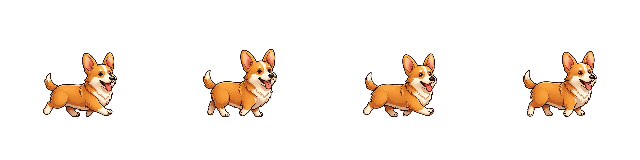

# Desktop and home scale review — 2026-09-08

## Corrected in this working tree

- Desktop `BaseBehavior` previously recalculated the whole sprite scale from each frame's opaque height. A raised head or paw shrank the body and lifted its baseline. Drawing and alpha hit testing now use the same fixed species/atlas camera scale. Explicit breathing, jumping and species-specific squash remain intact.
- Home actor size no longer depends on depth or bond. Legacy home clips share a single bank scale instead of independently fitting each action to the same box; lying down can reduce height without enlarging the body.
- Original Corgi production images are unchanged. This batch adds regression tests, not replacement artwork or additional frames.

## Current-tree evidence

- `:app:testDebugUnitTest`: 203 tests, zero failures/errors.
- Debug APK, test APK and `:app:lintDebug`: successful.
- Full instrumentation on disposable `emulator-5580`: **124 tests reported**, 49.158 seconds: 123 passed and one overlay permission assumption skipped. The later locomotion review separately exercises that overlay test. Includes migrations, repository rewards, care, physics, home, localization and store tests. No database tests ran on the user's phone.
- Targeted desktop/home/all-pet smoke instrumentation: 10 tests passed before the full run.
- `python3 -m unittest tools.test_pet_pipeline tools.care.test_atlases`: 14 passed.
- `python3 tools/validate_pet_assets.py`: 280 production frames across 15 pets accepted.
- Desktop renderer regression measures original Corgi frames 10–13: width and foot baseline remain within one raster pixel. A separate synthetic pose test ensures raised and lowered poses retain body width and ground contact.
- Home regression covers unchanged size after movement toward a bed and bond changes, plus lower sleep posture without width inflation.

## Remaining product acceptance

The scale correction was subsequently installed on the physical NE2213 at `192.168.1.204:41701`. All nine render-only desktop/home tests passed in 4.905 seconds, and the selected Yuki was observed on the actual desktop. The Corgi image above is a render-test strip, not a live overlay recording. The phone review does not establish all-species visual acceptance.

A fixed rendering camera cannot correct inconsistent anatomy or camera scale already baked into drawings. Per-species idle/walk/turn/care transitions still need visual landmark review. Existing home clip fallback and missing dedicated transitions are tracked in `MOTION-ASSET-AUDIT.md`. Neither structural asset validation nor the green suite accepts those animations as finished.

Next visual work should preserve silhouette and face, assess planted/support/swing phases, match stride distance to foot contacts, then add only the missing transitional poses. Review both facing directions, care entry/exit and desktop dragging/release. Do not compensate for drawing errors with per-frame bounding-box fitting.

Commercial acceptance remains separate: pet/cosmetic/decoration previews exist, but their presentation and appeal need visual review. Real Play purchases/restoration, physical lifecycle/soak/performance and all-15-pet visual acceptance remain outstanding. No new real-money products or production publication were introduced.
